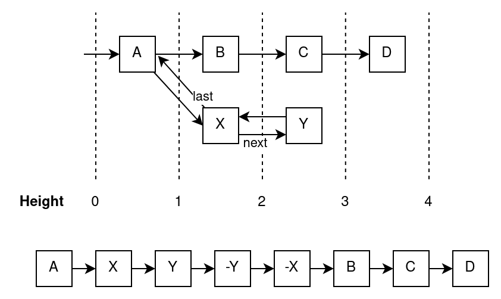
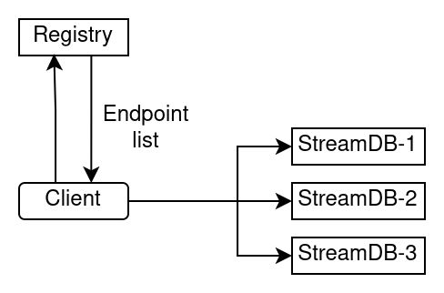

# StreamDB Client JS

## Installation

StreamDB Client requires [Node.js](https://nodejs.org/) v12+ to run.

Install @proximaone/stream-client-js package.
```sh
yarn add @proximaone/stream-client-js
```

Install the dependencies and devDependencies.
```sh
yarn install
```

## Client Usage

### Reading the stream from the beginning

The most simple scenario is just consuming all the events from the stream.

```typescript
const client = new ProximaStreamClient();
const name = "proxima.eth-main.blocks.1_0";
const pauseable = await client.streamEvents(name, Offset.zero);
pauseable.observable.forEach(event => {
    console.log({
        offset: event.offset,
        payload: decodeJson(event.payload),
        undo: event.undo,
        timestamp: event.timestamp,
    });
});
```
[Full code](samples/basic.ts)

### Reading the stream starting from given position

Sometimes you may want to skip first events of the stream and start reading from a certain point. How do you get the offset to pass to the `streamEvents` call?

One option would be to find it through the UI (TODO: add link).
However it may be more convenient to do it directly from the code. For this you have to use `StreamRegistryClient` which provides access to information about the streams themselves. You can find the offset by events's height or timestamp (see [Concepts](#concepts)).

```typescript
const registryClient = new StreamRegistryClient();
const offsetByHeight = await registryClient.findOffset(name, 1000000);
assert(offsetByHeight);
const offsetByTime = await registryClient.findOffset(name, undefined, 1667131199000);
assert(offsetByTime);
const pauseable = await client.streamEvents(name, offsetByHeight);
```

### Finding all existing streams

Another useful function of `StreamRegistryClient` is fetching a list of all streams. You can get the first event of each stream like this.

```typescript
const client = new ProximaStreamClient();
const registryClient = new StreamRegistryClient();
for (const stream of await registryClient.getStreams()) {
    const encoding = stream.metadata.labels["encoding"];
    if (encoding != "json") {
        console.log(`Stream ${stream.name} has unknown encoding: ${encoding}`);
        return;
    }
    const events = await client.fetchEvents(stream.name, Offset.zero, 1, "next");
    const event = events.pop()!;
    console.log(`Stream: ${stream.name} (${stream.metadata.description})`);
    console.log(decodeJson(event.payload));
}
```
[Full code](samples/streamsPreview.ts)

### Handling backpressure

If you are processing events slower than read them they are accumulating in memory possibly causing too high memory consumption. In order to automatically pause reading new events during consumption you can use a `BufferedStreamReader` helper.

```typescript
const bufferSize = 10000;
const chunkSize = 1000;
const streamReader = BufferedStreamReader.fromStream(pauseable, bufferSize);
while (true) {
    const chunk = await streamReader.read(chunkSize);
    if (chunk === undefined) {
        console.log("Completed");
        break;
    }
    assert(chunk.length <= chunkSize);
    console.log(`Processing batch from ${chunk[0].offset} to ${chunk[chunk.length - 1].offset}...`);
    await sleep(500);
}
```
[Full code](samples/bufferedReading.ts)

## Concepts

In order to fully understand the client design you should first learn some facts about the event streams themselves.

TODO: add link to Proxima documentation



### Handling reorgs
First, the streams are immutable (append-only). That means that after the event was produced to the stream it can never be removed from it even if no one has consumed it yet. But the sources of most our streams' events are blockchains which are not immutable. After publishing events coming from some blocks "X" and "Y" those blocks could be "forked" rewriting history with blocks "B", "C" and "D" instead. As we can't remove published events from the stream, we publish "undo" events ("-Y" and "-X" on the illustration) which logically cancel the effect of previous events. Each "undo" event corresponds to the last uncancelled event in the stream, has the same payload and has `undo` property set to `true`.

### Offset
**Offset** is some unique pointer to the place in event history. Offset actually points not to the event but to the state between the events. Every stream has initial offset `Offset.zero`.

### Height
We call a **height** of an offset a number of events directly preceding it, without considering forks. Hence every regular event increases height by one and every undo event decreases it by one.

### Timestamp
Each event has a **timestamp** which is the time when the event actually happened. For example, when the block was mined in a blockchain. It may differ from a time when that event got produced to the stream. Timestamp of an offset is the timestamp of the event preceding it.

Aside from epoch time in milliseconds a timestamp may contain additional `parts` which help to strictly order the events with equal time. For example, `parts` list may contain index of transaction inside a block and index of emitted log inside a transaction.

### Reading direction
When you try to read stream events starting from a given offset most client methods will require specifying a direction of reading which can be either `next` or `last`. It controls the direction of consumption.
- The `next` mode starts reading events that happened after the given offset, in the order they were produced. Note that because the offset points between the events the first produced event in this mode may have timestamp greater than the timestamp of the given offset.
- The `last` mode starts reading events backwards from the given offset. Note that because the offset points between the events the first produced event in this mode will have a timestamp equal to the timestamp of the given offset.

## Internals

Instead of having a single backend service the client actually communicates to multiple services:
- **Stream registry** which stores streams metadata and endpoints of StreamDBs for a given stream.
- **StreamDB** instances which store stream events.

For accessing them there are two client classes:
- `StreamRegistryClient` which only accesses stream registry and can fetch metadata.
- `ProximaStreamClient` which makes requests to both stream registry and StreamDBs. It fetches a list of StreamDB endpoints from the registry and uses it to automatically connect to the correct instances and switch between them when necessary.


